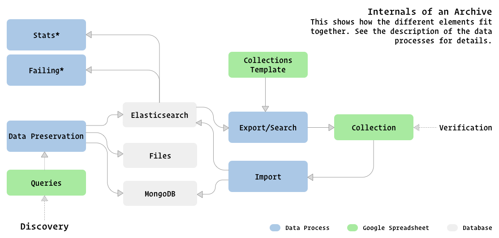

# The Archive of Archives

> The source of all archives.

This repository is used for any active development on the data infrastructure of the [Syrian Archive](https://syrianarchive.org/en), the [Yemeni Archive](https://yemeniarchive.org/en) and the Sudan Archive. Any changes are ported back into the respective code repositories [here](https://github.com/critocrito/syrian-archive), [here](https://github.com/critocrito/yemen-archive) and [here](https://github.com/critocrito/sudan-archive). To install your own version of this archive see the [installations instructions](./docs/installation.md) for further information.

## Overview

This repository contains all elements of the infrastructure of the Syrian Archive. At it's core it uses [SugarCube](https://github.com/critocrito/sugarcube) for it's data preservation and processing. Google Sheets are used as an interface to manage data sources, import and export collections and verification of data. All data is stored in a MongoDB and Elasticsearch.

This following diagram shows a high level view of the different parts.

All data processes are can be found in the `bin` directory. They are shell scripts and are responsible to call any SugarCube pipeline with the right configuration. The pipelines themselves are defined in the `pipelines` directory.

### Data Processes

The data processes that fetch data from a source are configured in a Google Spreadsheet. See [Archive Queries Template](https://docs.google.com/spreadsheets/d/1Be0ZoDQkPQI8kUyHl-TkWcX0heP1aU300x5X5ECoymk/edit?usp=sharing) for a template of such a spreadsheet. Every source has it's own sheet and the sources that should be preserved are collected there. Most of those processes are run automatically once a day.

#### `bin/youtube-videos.sh`

This process fetches individual Youtube videos on an `incoming` sheet and once fetched moves it to the `done` sheet.

#### `bin/youtube-channels-historic.sh`

If a new channel is added, they are added to the `historic` sheet to make a full scrape of all videos. Once a channel has been preserved, it moves over to the `daily` sheet for the daily preservation of new videos.

#### `bin/youtube-channels-daily.sh`

New videos published on a channel are preserved on a daily basis by this process.

#### `bin/twitter-tweets.sh`

This process fetches individual Tweets on an `incoming` sheet and once fetched moves it to the `done` sheet.

#### `bin/twitter-feeds.sh`

User timelines are preserved using this data process. It runs daily.

#### `bin/export-videos.sh`

Videos in the collection can be exported to a collections spreadsheet using this process. Search parameters for the export can be set in an export spreadsheet. See [Archive Exports Template](https://docs.google.com/spreadsheets/d/1IsogK13dawk-dHGeHxDWW8HEzd8fAYlaU4ZvZcnjg2k/edit?usp=sharing) for an example of such a spreadsheet. This process will either export to an existing collections spreadsheet, or create a new one based on an [Archive Collections Template](https://docs.google.com/spreadsheets/d/1Q4dBLm98zcYHm6kR3N4ardwVohWX-HPapNlv9Az_Er0/edit#gid=0).

Since Google spreadsheets have a limitation on the amount of rows they allow (~40.000), there is a sibling process in `bin/estimate-export-videos.sh` that can be used to first verify the number of videos that would be exported.

#### `bin/import-collections.sh`

The various collection spreadsheets are used for verification and annotation purposes. This data process can sync those changes back into the database.

#### `bin/youtube-videos-failing.sh`

Every month all videos in the database are checked if they are still accessible online. This process verifies Youtube videos.

#### `bin/youtube-channels-failing.sh`

The same as with videos, Youtube channels are also checked if they are still available online.

#### `bin/twitter-feeds-failing.sh`

This process verifies which of the twitter feeds are still available online.

#### `bin/stats-sources.sh`

Quickly print some aggregates of the various sources in the database.

#### `bin/stats-locations.sh`

Print statistics on observations in the database that have geo locations attached.

### Databases

The primary database currently is MongoDB. It acts as a source of truth. This might change in the future to PostgreSQL. From this source of truth we can derive a version that stores the relevant fields in Elasticsearch. All search of data is done using this. Videos and images are stored as files on the file system. There are multiple backups of those files. Some data processes, e.g. the ones checking for failing data, produce additionally data in CSV format that is stored as files as well.

## License

[GPL3](./LICENSE) @ [Christo](christo@cryptodrunks.net) and [Syrian Archive](info@syrianarchive.org).
